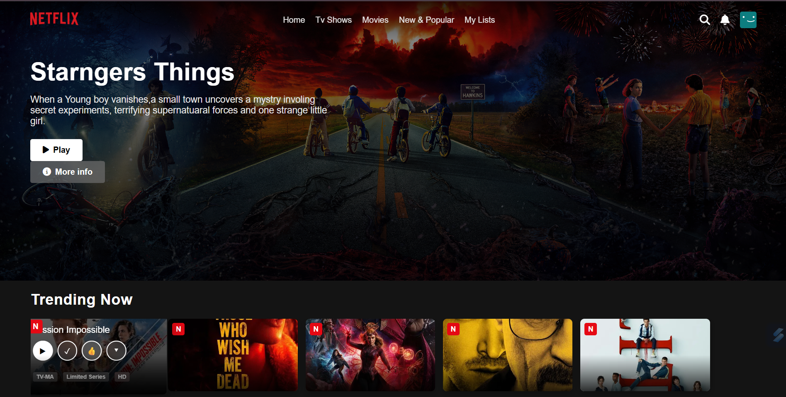

# Netflix-Clone
A fully responsive clone of Netflix's homepage built using HTML, CSS, and JavaScript. Includes navigation bar, hero section, trending movies, and an interactive profile details page.

### Key Features
🧭 Navigation Bar & Hero Banner – Netflix-style top bar with logo.

🎬 Movie Rows – Multiple horizontal sections showing movie posters.

📱 Responsive Design – Works on all screen sizes using Flexbox & media queries.

❓ FAQ Accordion – Click-to-expand Q&A section like Netflix’s help page.

🎨 Hover Effects – Smooth transitions on buttons and elements.

📎 Footer Section – Replicated multi-link footer with support links.

⚙️ Vanilla Stack – Built using only HTML, CSS & JavaScript (no frameworks).

# Demo img

### Impact & Learning:
This project helped me strengthen my front-end skills by building a responsive and visually accurate Netflix-style UI using only HTML, CSS, and JavaScript.
